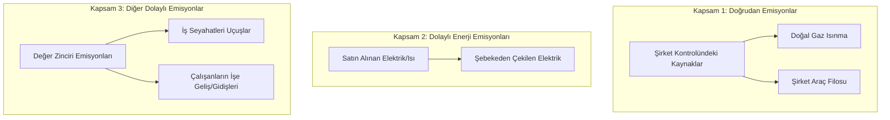

# Çevre Yönetimi ve Sürdürülebilirlik (ESG & ISO 14001)

Sürdürülebilirlik, modern mühendisliğin en kritik parametrelerinden biridir. Şirketlerin çevresel etkilerini en aza indirmesi ve sosyal sorumluluk çerçevelerine uyması ESG (Environmental, Social, Governance - Çevresel, Sosyal, Yönetişim) kriterleri ile ölçülür.

## ISO 14001:2015 Çevre Yönetim Sistemi

ISO 14001, bir kuruluşun çevresel performansını artırmak, yasal yükümlülükleri yerine getirmek ve çevre amaçlarına ulaşmak için kullandığı yönetim sistemidir.
*   **Yaşam Döngüsü Yaklaşımı:** Hammadde tedarikinden başlayarak tasarım, üretim, taşıma ve kullanım ömrü sonu imha süreçlerinin tamamındaki çevresel etkilerin kontrol edilmesini hedefler.
*   **ÇED (Çevresel Etki Değerlendirmesi):** Gerçekleştirilmesi planlanan projelerin çevreye olası olumlu ve olumsuz etkilerinin belirlenmesi, olumsuz etkilerin önlenmesi ya da en aza indirilmesi için alınacak önlemlerin raporlanması sürecidir.

---

## Sera Gazı Protokolü (GHG Protocol) Emisyon Kapsamları

Kurumsal karbon ayak izi hesaplamaları Sera Gazı Protokolü standartlarına göre üç ayrı kapsamda (Scope) sınıflandırılır:

### Emisyon Faktörleri Hesabı
Emisyonlar, tüketim verilerinin o kaynağa ait emisyon faktörüyle çarpılmasıyla hesaplanır ve Karbon Dioksit Eşdeğeri ($CO_2e$) cinsinden ifade edilir.
$$\text{Emisyon} (\text{kg } CO_2e) = \text{Tüketim Miktarı} \times \text{Emisyon Faktörü}$$

*   **Elektrik (Scope 2):** Türkiye şebeke ortalaması yaklaşık $0.45\text{ kg } CO_2e/\text{kWh}$.
*   **Dizel Yakıt (Scope 1):** Yaklaşık $2.68\text{ kg } CO_2e/\text{Litre}$.
*   **Doğal Gaz (Scope 1):** Yaklaşık $1.90\text{ kg } CO_2e/\text{m}^3$.

---

## Klasördeki Araç

*   **[carbon_footprint.py](file:///g:/Diğer bilgisayarlar/Dizüstü Bilgisayarım/github repolarım/engineering-tools/environment/sustainability-reports/carbon_footprint.py):** GHG Protocol metodolojisini kullanarak işletmelerin Kapsam 1, Kapsam 2 ve Kapsam 3 emisyonlarını hesaplayan, en yüksek emisyon kaynağına göre azaltım önerileri sunan ve ESG raporunu `.txt` olarak kaydeden interaktif bir emisyon hesaplayıcıdır.
