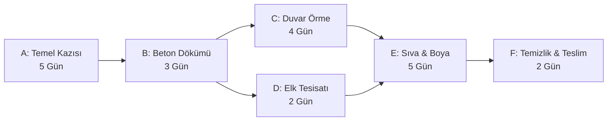

# Proje Yönetimi ve Planlama Standartları

Büyük mühendislik projelerinde (inşaat, makine imalatı, altyapı projeleri) zaman planı, kaynak ataması ve maliyet kontrolü hayati önem taşır. Bu süreçleri yönetmek için endüstride yaygın olarak **MS Project** ve **Oracle Primavera P6** yazılımları kullanılır.

## Kritik Yol Metodu (Critical Path Method - CPM) nedir?

CPM, bir projedeki iş adımlarının (aktivitelerin) süreleri ve aralarındaki bağımlılıkları analiz ederek projenin **en kısa sürede nasıl tamamlanacağını** belirleyen matematiksel bir yöntemdir.

### Temel Kavramlar:
*   **ES (Early Start - Erken Başlangıç):** Bir görevin öncül görevleri bittiğinde başlayabileceği en erken zaman.
*   **EF (Early Finish - Erken Bitiş):** Bir görevin bitebileceği en erken zaman ($EF = ES + \text{Süre}$).
*   **LS (Late Start - Geç Başlangıç):** Proje bitiş tarihini geciktirmeden bir görevin başlayabileceği en geç zaman.
*   **LF (Late Finish - Geç Bitiş):** Bir görevin tamamlanabileceği en geç zaman ($LF = LS + \text{Süre}$).
*   **Slack / Float (Bolluk Süresi):** Bir görevin projeyi geciktirmeden ne kadar ertelenebileceğini gösterir ($Slack = LF - EF$ veya $LS - ES$).
*   **Kritik Yol (Critical Path):** Bolluğu (slack) sıfır olan görevler zinciridir. Bu yol üzerindeki herhangi bir gecikme, projenin toplam bitiş tarihini doğrudan geciktirir.

---

## Örnek Proje Ağı (Aktivite Şeması)

Aşağıdaki şemada aktivitelerin birbirlerine olan bağımlılıkları gösterilmiştir:

Bu ağda kritik yol **A -> B -> C -> E -> F** şeklindedir ve toplam süre **19 gündür**. D görevi (Elektrik tesisatı) 2 günlük bir bolluğa (slack) sahiptir, bu yüzden projeyi aksatmadan 2 gün gecikebilir.

---

## Program Değerlendirme ve Gözden Geçirme Tekniği (PERT)

Olasılıksal sürelerin kullanıldığı projelerde PERT yöntemi, her görev için üç farklı süre tahmini alır:
1.  **İyimser Süre (Optimistic - o):** Her şeyin kusursuz gitmesi durumunda gereken süre.
2.  **En Muhtemel Süre (Most Likely - m):** Normal koşullarda beklenen süre.
3.  **Kötümser Süre (Pessimistic - p):** Aksiliklerin yaşanması durumunda gereken süre.

Beklenen Süre ($t_e$) ve Varyans ($\sigma^2$) formülleri:
$$t_e = \frac{o + 4m + p}{6}$$
$$\sigma^2 = \left(\frac{p - o}{6}\right)^2$$

Kritik yol üzerindeki görevlerin varyansları toplanarak projenin standart sapması ($\sqrt{\sum \sigma^2_{kritik}}$) hesaplanır ve projenin belirli bir sürede bitme olasılıkları istatistiksel (z-tablosu) olarak öngörülebilir.

---

## Klasördeki Araç

*   **[cpm_calculator.py](file:///g:/Diğer bilgisayarlar/Dizüstü Bilgisayarım/github repolarım/engineering-tools/mechanical-civil/project-management/cpm_calculator.py):** İster tekil sabit sürelerle (CPM) ister olasılıksal üçlü süre tahminleriyle (PERT) çalışabilen; erken/geç süreleri, bollukları, kritik yolu bulurken aynı zamanda kritik yol varyansını, standart sapmasını ve belirli güven aralıklarında projenin teslim olasılıklarını hesaplayan gelişmiş bir proje planlama aracıdır.
